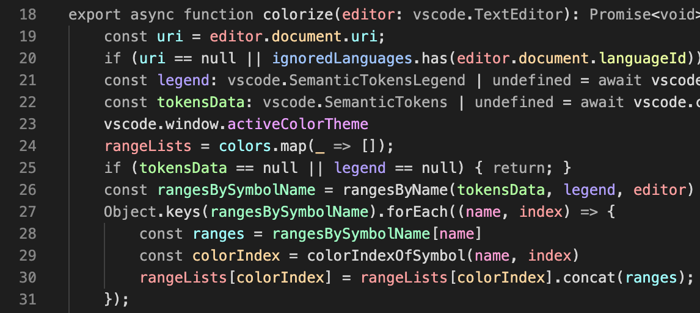
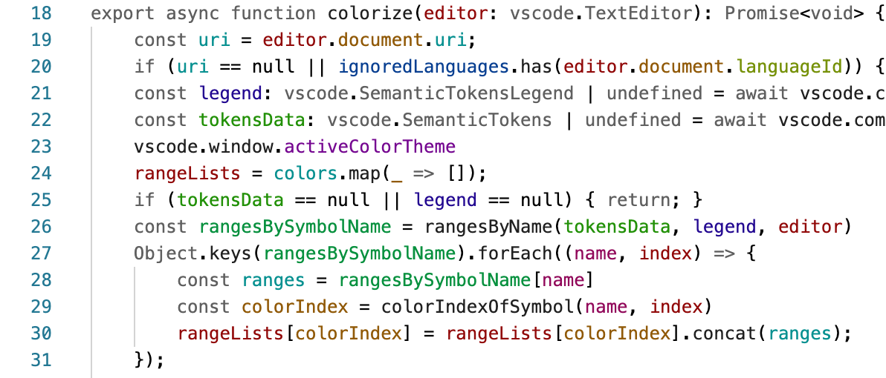

# Color Identifiers for Visual Studio Code

Color Identifiers is a syntax highlighter that gives each identifier a different color, inspired by [Color Identifiers Mode](https://github.com/ankurdave/color-identifiers-mode) for Emacs.

## Features

This extension works for any language that offers semantic highlighting in Visual Studio Code. It uses the language server to determine which words to highlight.

Two themes, Color Identifiers Dark and Color Identifiers Light, are included. These themes make variables more prominent and language keywords less prominent. Color Identifiers is also compatible with any existing theme.

## Extension Settings

This extension contributes the following settings:

* `colorIdentifiersMode.tokenKinds`: The types of language tokens that should have a color applied.
* `colorIdentifiersMode.paletteMode`: Automatic or manual. The automatic palette chooses colors that are likely to work well with the active color theme. The manual palette chooses colors from a user-defined list.
* `colorIdentifiersMode.manualColors`: The list of colors used in the manual palette mode.
* `colorIdentifiersMode.ignoredLanguages`: Don't colorize files in these languages.
* `colorIdentifiersMode.method`: Sequential or hash. Sequential mode assigns colors to identifiers in the order the identifiers appear in the file. Hash mode uses the variable's name to decide its color.
* `colorIdentifiersMode.ignoredFileSize": Ignore files greater than this size in bytes.
